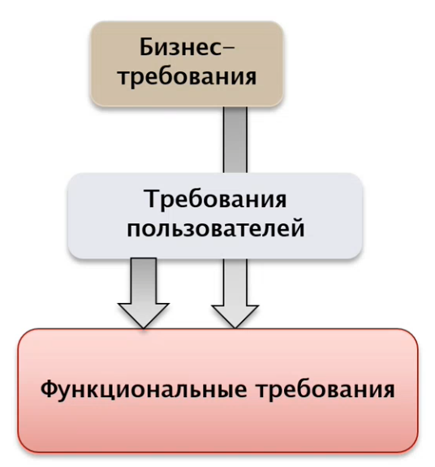
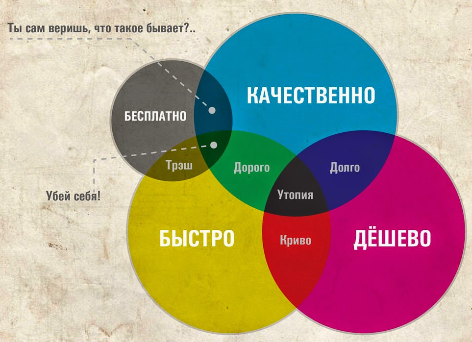
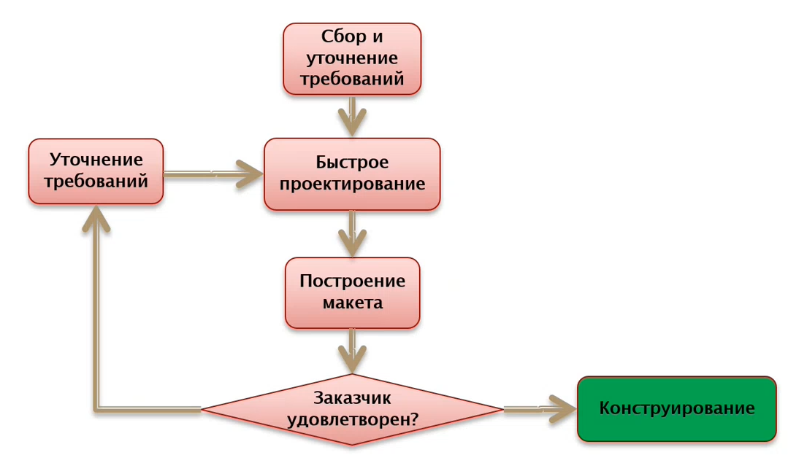
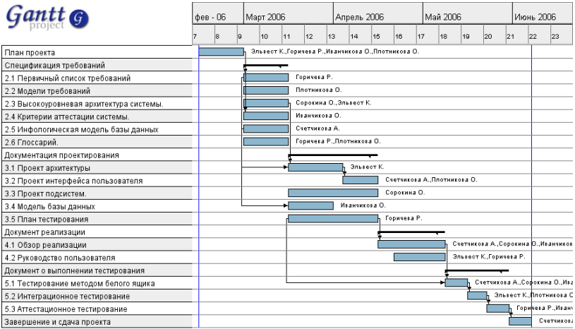
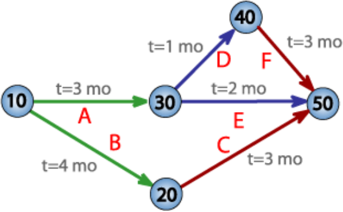

# 8. Стратегии конструирования ПО. Экстремальное программирование

Экстремальное программирование (extreme programming, XP) ориентировано на группы до 10 человек.

Вся группа обязательно находится в одном помещении.

Процесс:

- гибкий
- динамичный
- итеративный
- может быть изменяющимся - XP наиболее для этого подходит

Основные "занятия":

- написание кода
- тестирование
- получение требований/изменений от заказчика
- проектирование

Приспособление к изменениям (динамика) из-за:

- постоянной связи с заказчиком
- выбора простейшего решения
- быстрой обратной связи
- профилактики проблем

Основные практики XP:

- игра в планирование
  - от заказчика получаем объём работ, временные требования и сроки выпуска
  - от разработчиков - временные оценки, последствия и ход работы
- небольшие версии
  - выпуск маленьких и простых версий
  - версия обязательно должна быть завершённой
  - примерно 1 версия в 14 дней
- метафора
  - видение проекта с примерными требованиями архитектуры
  - сведения об архитектуре
- простой дизайн
  - проходят все тесты
  - отсутствует дублирующая логика
  - минимальное число классов/методов
  - новое добавляется только тогда, когда оно нужно
- тестирование
  - юнит-тесты для всего кода от разработчиков
  - функциональное тестирование от заказчика
  - код разрабатывается вместе с тестами или после них
- рефакторинг
  - изменение программы без фактического изменения функциональности
  - для упрощения добавления нового функционала
- парное программирование (!!!)
  - разработчики работают парами
  - тот, кто пишет код, думает над конкретной реализацией
  - тот, кто рядом, думает стратегически
  - состав пар меняется
- коллективное владение
  - код - общий, мгновенно изменяется при необходимости
- непрерывная интеграция
  - интеграция кода - постоянная, не реже одного раза в день
  - кончается после прохождения всех тестов
  - ответственные - те, кто внесли изменения
- 40ч рабочая неделя
  - переработки нежелательны, свидетельствуют о неправильной организации работы
  - отпуск обязателен
- локальный заказчик (!!!)
  - вместе с разработчиками обязательно присутствует представитель заказчика - тот, кто будет пользоваться продуктом
  - отвечает на возникающие у разработчиков вопросы
  - наличие представителя - способ наискорейшей коммуникации

# 9. Стратегии конструирования ПО. Методология SCRUM

SCRUM изначально появился в компании Toyota. Подход оказался хорошо масштабируемым и переносимым на разработку ПО.

SCRUM:

- гибкий
- итерационный
- адаптируемый под многие процессы
- масштабируемый, что важно для гибких подходов
- применим к любым этапам/особенностям разработки ПО
- хорошо стыкуется с использованием ООП-подхода

Планирование реализуется с помощью спринтов:

- каждые 7/14/30 дней, не больше 30 дней
- реализует часть функциональности

Встречи разработчиков:

- до начала каждого спринта - sprint planning meeting
- ежедневно - тот самый scrum ("схватка с англ.")
- после конца спринта - спринт-ревью с демонстрацией результатов

Генерируемые артефакты:

- backlog 
  - список целей/задач, необходимых для реализации всего проекта
  - "журнал пожеланий проекта"
- sprint backlog
  - список целей/задач, необходимых для реализации спринта
  - "журнал пожеланий спринта"
- burndown chart (диаграмма сгорания задач)
  - показывает идеальный темп выполнения задач, текущее положение дел и "температуру" проекта
- scrum board
  - минимальный размер - 3 столбца: TODO, in progress и done
  - строки - либо зоны ответственности разработчиков, либо типы задач

Роли участников:

- основные
  - product owner
  - scrum master
  - scrum team
- остальные
  - пользователи
  - эксперты-консультанты

Ход работы (относительно выполнения задач):

- формируется product backlog (все изменения - только сюда)
- его небольшой кусочек выносится в sprint backlog (заморожен ДО КОНЦА СПРИНТА)
- команда независимо работает над своим спринтом
- на выходе - готовый кусок функционала

Ход работы (относительно зон ответственности):

- заказчик определяет функциональные требования, периодически их меняет
- владелец продукта расставляет приоритеты
- формируются группы (обычно 1-6, реже вплоть до 9) для выполнения отдельных частей проекта
- формируется project backlog
- формируется sprint backlog для каждой группы
- выполняются спринты (автономно)

На каждой scrum-встрече каждый из команды:

- рассказывает, что сделал за предыдущий день
- рассказывает, что сделает за сегодняшний
- рассказывает, что мешало работе (scrum master пытается разрешить эти проблемы)

SCRUM эффективен без каких-либо менеджеров из-за:

- ежедневных встреч для "синхронизации" работы
- небольших групп

SCRUM часто объединяется с прочими методологиями, сейчас почти отсутствует в чистом виде.

# 10. Стратегии конструирования ПО. Бережливая разработка ПО 

Разработана в компании Toyota. 
Является адаптивной эволюционной статегией с  рекомендуемой командой до 10 человек. Отличается низкой продолжительностю проекта, наличию промежуточных версий и пригодностью к работе с информационными системами.

Когда команда следует принципам бережливой разработки, она не просто выполняет задачи, а стремится сделать продукт с наименьшим количеством ошибок

## Идея:

Бережливость заключается в сокращении потерь. 
В компании вносят только те изменения, которые приносят пользу, требуют минимум затрат и отнимают не более 30% запланированного времени.

## Потери: 

- Потери при разработке ПО 
  - Лишние функциональные возможности. Делаем вещи, которые не нужны. 
- Избыточное проектирование (Overengineering)
  - Тратим много веремни на "полировку", что не требуется для конечного продукта и только тратит время
- Незавершенные работы   
  - Незавершенные работы из-за изменений требований в процессе работы
- Поиск и исправление ошибок 
  - Время на поиск и исправление ошибок
- Ожидание 
  - Разные ожидания, когда мы ждем других разработчиков, результатов тестов и т.д.
- Избыточные процессы 
- Дефекты

## Принципы:

- Исключение или уменьшение потерь 
  - Исключение того, что не приносит пользы.
- Постоянное обучение 
  - Активная обратная связь с заказчиком, чтобы своевременно появлялась информация об изменениях. Чтобы разработчики не тратили время на то, что системе не нужно или на то, что изменилось. 
- Позднее принятие решений 
  - Не прогнозы, а факты. Хотим сделать как можно проще не на основе прогноза о том, что будут сложные труктуры, а на фактической реализации, т.е. когда в действительности становится фактом то, что нужно делать архитектуру сложнее. 
- Быстрая доставка 
  - Короткие итерации с передачей версий заказчику. 
- Мотивация команды 
  - Люди – не ресурс. ОТношение к людям как к единомышленникам. МНогие вопросы решаются совместно, распределение задач. Иными словами - максимальная вовлеченность команды в принятие решений. 
- Интегрирование 
  - Целостная архитектура. Понимание архитектуры заказчиком. Общее виденье о том, что происходит с системой и ее организациейю
- Целостное видение 
  - Разделение разработчиками принципов бережливости.
  - Видение проекта как единое целое. 

В последнее время бережливая разработка очень популярна во многих отраслях.

# 11. Управление требованиями. Требования в программных проектах. Свойства требований

Разработка требований - самая сложная часть проектирования ПО.

Проблемы определения требований:

* Требования пользователей постоянно меняются;
* Требования (заказчика) бывают неясны, двусмысленны, противоречивы и неполны;
* Пользователи могут быть недостаточно представительны *(видим только один взгляд на систему от одной группы пользователей)*;
* Получаемые спецификации недостаточно детализированы для правильного проведения проектирования.

Требование - *(стандарт: IEEE 1990)*:

- Условие или возможность, необходимые пользователю для решения его задач или достижения цели;
- Условие или возможность, которым должна отвечать или которыми должна обладать система или ее компоненты, чтобы удовлетворить контракт, стандарт, спецификацию или иной формальный документ;
- Документированное представление условия или возможности, указанное в (1) и (2).

При сборе требований хочется определить некоторые свойства, позволяющие определить **качество** собранных требований. *They are as follows*:

- Корректность;
- Однозначность;
- Полнота;
- Непротиворечивость;
- Приоритезация;
- Проверяемость;
- Модифицируемость;
- Отслеживаемость.

### Подробнее о свойствах и зачем они вообще:

**Корректность** - требование корректно, если оно отражает пожелания заказчика.
**Однозначность** - возникает, если при решении можно воспользоваться разными способами решения задачи *(50 shades of grey for grey button)*. Требования однозначны, если их формулировка подразумевает только одну трактовку.
**Полнота** - требования полны, если **все** пожелания заказчика нашли отражения в списке требований.
**Непротиворечивость** - возникает из-за объема спецификации или в разных "специфициремых" областях продукта *(неявные противоречия)*, обычно выявляется только путем глубокого анализа требований. Требования непротиворечивы, если нет нескольких требований, которые явно или неявно противоречат друг другу.
**Приоритезация** - требования должны быть разделены на относительные классы приоритетов, показывающие **значимость по времени или важности реализации** в системе.
**Проверяемость** - требования проверяемы, если они сформулированы таким образом, что каждое можно проверить и убедиться, выполнено оно или нет. Проверяемые требования обычно выражены **количественно**, непроверяемые - **качественно** *("быстрая работа" - качественное требование, плохое, в общем)*.
**Модифицируемость** - требования модифицируемы, если они сформулирвоаны таким образом, что предполагают относительно простую их модификацию *(как свойство оно плохо формализуемо, но в целом нужно и важно)*.
**Отслеживаемость** - требования отслеживаемы, если по каждому требованию можно проследить:

* Реализовано ли оно?
* Где конкретно оно реализовано?
* Оттестировано ли оно?

# 12. Управление требованиями. Типы требований. Проблемы определения требований

Виды требований достаточно условно делят на две группы:

* **Функциональные** (функции, которые должна выполнять система) (***ЧТО нужно сделать***). Формулируются как:
  * Бизнес-требования;
  * Ползовательские требования;
  * Собственно функциональные требования;
* **Нефункциональные** требования (***КАК нужно сделать***):
  * Ограничения;
  * Требования к качеству;

Для различных систем одни и те же требования могут принадлежать к разным группам (real-time системы, где скорость работы - **функциональное** требование. Либо еще какой-нибудь пример с эргономикой для случаев, когда удобство пользователя стоит на первом месте). В целом именно поэтому деление условно. 

### Функциональные требования

* Определяют набор функций, которые необходимо реализовать;
* Отвечают на вопрос ***ЧТО надо сделать?***.

По способу формулировки делятся на:

* Бизнес-требования:
  * Формулируются заказчиками;
  * Описывают цели, которых требуется достичь с данной системой;
  * Обычно - укрупненные, не содержат деталей;
  * (Глобально) определяют назначение ПО;
  * *Иногда описываются в документе о видении и границах проекта*.
* Пользовательские требования:
  * Какие задачи можно решить с помощью системы;
  * Формулируются со стороны пользователя.
* Функциональные требования:
  * Определяют требуемую функциональность.

Собранные бизнес-требования и пользовательские требования обычно анализируются и на их основе создают функциональные требования, которые, в свою очередь, документируют с помощью спецификации требований:

### Нефункциональные требования

* Отвечают на вопрос ***КАК надо сделать?***.
* Характеристики качества включают требования к:
  * надежности,
  * совместимости,
  * эффективности,
  * гибкости,
  * эргономике,
  * безопасности.
* Ограничения:
  * на программные интерфейсы, в т. ч. к внешним системам,
  * требования к применяемому оборудованию и ПО *(совместимость с win10, например)*,
  * соответствие стандартам и правилам,
  * требования к архитектурным решениям *(- Почему это может быть требованием? - Например, если разрабатываем часть чужой системы со своей архитектурой, и пытаемся в нее вписаться)*,
  * бюджет,
  * сроки.

### Общие ограничения на требования

Правило "2 из 3":

Что **НЕ** является требованиями?

* Детали архитектуры;
* Детали реализации;
* Сведения о планировании;
* Сведения о тестировании *(- Почему? - Пусть заказчик идет лесом, мы можем удовлетворить **уровень протестированности** (покрытие тестов, но это уже не о тестах, а о **требованиях к качеству**), а не написать ему N модульных тестов. Ицыксон сам толком не объяснил, почему, просто требование очевидно ненужное)*;
* Проектная информация *(оставьте менеджеру его работу!)*:
  * Процесс разработки;
  * Команда разработки;

# 13. Разработка требований. Выявление и анализ требований

Разработка требований - также отдельный этап инженерии требований. Ее разделяют на два этапа, результатом которых является **спецификация требований**.

### Выявление требований

Хотим узнать максимальное количество информации о разрабатываемой системе.

Используем все доступные средства, чтобы получить максимально возможный (пусть избыточный) объем требований заказчика.

Заинтересованные лица, участвующие в процессе:

* Заказчики;
* Менеджеры;
* Пользователи:
  * операторы,
  * администраторы,
  * ...
* Разработчики;
* Служба поддержки;
* Другие.

**Заказчик != пользователь**
Очень часто у заказчика и пользователя разные требования, заказчик может навредить пользователю при формировании требований.

*Классический подход (использовался ранее в классических методологиях разработки) подразумевал, что разработка требований и формирование спецификации требований - задача заказчика. Заказчик предоставляет исполнителю готовые требования.*

*Время показало, что подход нерабочий (заказчики не в состоянии сформировать спецификацию требований). Теперь **задача разработки требований - в первую очередь задача исполнителя**. Заказчик - главный источник информации, но окончательная спецификация требований остается за исполнителем. И этот этап - серьезная работа, котрую нужно оплачивать, выделять сроки, планировать...*

Способы выявления требований:

* Семинары;
* Интервью;
* Создание прототипов;
* Исследование;
* Работа с фокус-группами;
* *Остальные подобные перечисленным способы*.

**Семинар** - (самое популярное) открытое совместное обсуждение стоящих задач:

* Заказчик:
  * излагает имеющиеся требования,
  * отвечает на вопросы исполнителя;
* Исполнитель:
  * слушают требования заказчика,
  * задают уточняющие вопросы,
  * документируют требования.
    В результате формируются документы, после анализа превращающиеся в спецификацию требований.

**Интервью** - (если заказчик имеет смутное представление о разрабатываемом продукте, позволяет понизить требования к его IT-квалификации) целенаправленный опрос-интервью:

* Исполнитель:
  * готовит специализированный вопросник (анкету),
  * задает вопросы в соответствии с анкетой,
  * докоментирует ответы заказчика,
  * поясняет заказчику детали, если необходимо;
* Заказчик:
  * отвечает на вопросы исполнителя.

**Создание прототипов** - лучше один раз показать, чем много раз переспрашивать. Процесс:

* Обсуждение стоящих высокоуровневых задач;
* Исполнитель:
  * создает прототип,
  * демонстрирует,
  * исправляет недостатки,
  * документирует финальный прототип;
* Заказчик:
  * смотрит прототип и вносит изменения.

Прототипирование применяется, если:

* Имеются не все требования;
* Нужно быстро увидеть некоторые свойства продукта:
  * Удобство;
  * Внешний вид;
  * Применимость;
* Проектируются:
  * Информационные системы;
  * Программные продукты с ГПИ (GUI);

Для создания прототипа исползьуются:

* Средства быстрой разработки приложений;
* Специальные средства макетирования.

Общее устройство прототипирования:

Достоинства:

* Обеспечивает определение полных требований к ПО;
* Наглядно для заказчика;
* Позволяет на ранних этапах уидеть основные параметры проекта.

Недостатки:

* По сути не отражает полный жизненный цикл;
* Заказчик может принять макет за продукт (важно этот момент довести до заказчика, лучше заранее);
* Разработчик может принять макет за продукт (ожидаемые проблемы: немасштабируемость, ненадежность, незащищенность, проблемы с обработкой ошибок...).

**Исследование** - исследуем рынок и потребности пользователя. Общий алгоритм:

* Исполнитель:
  * получает от заказчика общее представление о продукте *("- Хочу калькулятор, который завоюет рынок")*;
  * исследует рынок и выявляет востребованные характеристики продукта;
  * Анализирует решения конкурентов;
  * Документирует актуальные свойства проектируемого продукта;
* Заказчик:
  * Предоставление общего видения продукта;
  * Корректировка и утверждение предложения исполнителя.

**Работа с фокус-группами** - составляем фокус-группу из будущих пользователей и ориентируемся на них (что из самых важных функций должно быть и т.п.). Обсудив продукт с фокус-группой, формируем ТЗ и обсуждаем его с заказчиком.

# 21. Ресурсы в программных проектах. Управление ресурсами 

**Ресурс** – объект проекта, подлежащий управлению и планированию, без которого невозможно выполнить какую-либо задачу программной инженерии. 

## Виды ресурсов: 

- Сотрудники 

  - Разделение на роли: Заказчик (customer), Менеджер проекта (project manager), Руководитель команды (team leader, team lead), Разработчик (developer), Тестер (tester, QA) и т.д.
    - Роль - конкретное амплуа сотрудника в конкретном проекте в определенное время. В программных проектах обычно оперируют ролями, а не сотрудниками

- Рабочее время 

  - Свойство сотрудника занимать какую-то роль определенное вермя в поректе. Является атрибутом связи «сотрудник-роль».

  Должно учитываться при формировании команды: 

  - Нестандартное время работы 
  - Выходные 
  - Сверхурочные 
  - Отпуска 
  - И т.д.

  Отдельно стоит учитывать праздники (особенно при транснациональном проекте), т.к. это может влиять на стоимость проекта, время старта/финиша проекта и т.д.

  В общем случае является внешним ограничением при решении задачи планирования

- Оборудование 

  Варианты:

  - Специализированное оборудование для разработки проекта 
  - Специализированное оборудование для исполнения проекта 
  - Специализированное оборудование для тестирования проекта 

- Машинное время

  - Если оборудование является узким ресурсом, то это то время, которое мы можем пользоваться в целях создания/тестирования проекта является ресурсом, которым необходимо управлять

- ПО (ОС, среда разработки, специализированный софт и т. д.)

  Варианты:

  - ПО для разработки проекта 
  - ПО для исполнения проекта 
  - ПО для тестирования проекта 

Оборудование/машинное время или ПО могут стать узким местом, если одновременно требуется разработчикам для отладки, тестироваям для отладки и заказчику.
Этих элементов оборудования может быть недостаточное число, в результате чего возникают проблемы.

Оборудование, машинное время и ПО в общем случае являются внешними ограничением при решении задачи планирования.

# 22. Роли участников в программных проектах

Роль - конкретное амплуа сотрудника в конкретном проекте в определенное время. 
В программных проектах обычно оперируют ролями, а не сотрудниками.

Состав, назначение и функциональные обязанности ролей зависят от конкретного процесса разработки в компании. 
В принципе возможно совмещение разных ролей в разных проектах.

## Роли в процессе разработки программных проектов:

- Основные:
  - __заказчик__ (customer)
  - __планировщик ресурсов__ (planner)
  - __менеджер проекта__ (project manager)
  - __архитектор__ (architect)
  - __руководитель команды__ (team leader, team lead)
  - __разработчик__ (developer)
  - __тестер__ (tester, QA)
  - __разработчик документации__ (technical writer)
  - __пользователь__ (user)
  - __инженер группы поддержки__ (support engineer)

- Дополнительные:
  - __эксперт предметной области__
  - __специалист по пользовательскому интерфейсу и эргономике__
  - __ответственный за выпуск релизов__
  - и т.д.

## Конкретнее о некоторых ролях:

### Заказчик:

- Инициирует разработку
- Участвует в сборе требований
- Участвуете в разработке спецификаций требований
- Принимает результаты разработки

### Планировщик ресурсов:

- Член руководства организации 
- Выдвигает и координирует требования к проектам в организации
- Развивает и направляет план выполнения проекта с точки зрения организации
- Обеспечивает финансирование проекта

### Менеджер проекта:

- Внешние функции:
  - взаимодействия с _заказчиком_ и _планировщиком ресурсов_
- Внутренние функции:
  - Распределяет задачи среди членов команды
  - Организует выполнение проекта
  - Контролирует процесс разработки

### Архитектор:

- Проектирует архитектуру системы
- Разрабатывает основные проектные решения
- Определяет общий план развития проекта
- Определяет инфраструктуру разработки

### Руководитель команды:

- Является "главным разработчиком"
- Осуществляет техническое руководство командой
- Разрешает технические вопросы

### Разработчик:

- Реализует проектируемые компоненты
- Создает классы и методы
- Осуществляет кодирование
- Разрабатывает модульные тесты
- Выполняет автономное тестирование
- Внутри команды может иметь специализацию

### Тестировщик:

- Проверяет качество программного обеспечения (функциональность, надежность, эффективность и т.д.). 
  Составляет тесты для каждой фазы проектирования продукта.
- Исполняет созданные тесты
- Выполняет функциональное тестирование 
- Выполняет интеграционное, системное тестирование

### Разработчик документации: 

- Разработка программной документации
- Разработка эксплуатационной документ
- Ведение информационной поддержки процесса разработки

### Пользователь:

- Не является заказчиком проекта
- Может являться, а может и не являться сотрудником проекта
- Является главным потребителем проекта
- Обычно существуют группы пользователей проекта

### Эксперт предметной области: 

- Обеспечивает информационную поддержку в предметной области проекта
- Может быть несколько экспертов, если проект большой

### Специалист по пользовательскому интерфейсу и эргономике:

- Проектирует пользовательские интерфейсы
- Взаимодействует с заказчиком
- Анализирует и оценивает комплексные характеристики интерфейса:
  - Удобство
  - Эргономичность
  - Лаконичность 
  - Дружественность
  - Локализуемость
  - ...

### Ответственный за выпуск релиза:

- Определяет и реализует политику выпуска релизов
- Формирует и проверяет требования к конкретному релизу:
  - Необходимая функциональность
  - Состав релиза
- Определяет дату выхода релиза
- Контролирует процесс выхода релиза

### Библиотекарь:

- Ведет библиотеку проекта
- Контролирует соответствие выпускаемого продукта принятым стандартам

## Совмещение ролей

# 23. Взаимодействие между ролями в программных проектах

## Связи для планировщика ресурсов

## Связи для менеджера проекта

## Связи для архитектора

## Связи для руководителя команды

## Связи для разработчика

## Связи для тестировщика

## Связи для разработчика документации

## Связи для пользователя

## Связи для заказчика

# 24. Проектные активности программных проектов

- Программный проект - самостоятельно управляемый элемент разработки
- Нормальный результат программного проекта - программный продукт

Для того чтобы пройти все эти стадии нам необходимо управлять не только ресурсами, но и теми сущностями, что у нас есть внутри программного проекта.

Сущностей довольно-таки много и в общем случае разработчик, работая над проектом, обычно занимается двумя основными активностями:

1. Выполнение задач из ТЗ (подчиненных проектов, работ, реализация изменений)
2. Исправление дефектов (bug fixing)

Принципиальное отличие первого пункта от второго - первое, то что входит в проектный план, это запланированные активности, которыми разработчик должен заниматься для удовлетворения требований ТЗ, в то время как исправление дефектов - это непрогнозируемая активность, которой разработчик начинает заниматься в случае, если тестировщик обнаружил ошибки в программном коде, в функционировании программной системы.  

Сколько будет найдено ошибок, когда они будут найдены, насколько сложны эти ошибки, спрогнозировать невозможно, поэтому кроме прогнозируемых активностей разработчик занимается непрогнозируемыми активностями.

# 25. Временные сущности программных проектов

Временные сущности проектов:   

- Этапы (**stage**)
- Вехи (**milestone**)

## Этап программного проекта

Этап проекта – множество задач проекта, подчиненных достижению какой-либо локальной цели.   
Обычно этап – элемент проекта, видимый Заказчику. Заказчик может контролировать выполнение этапа.   
К этапам обычно привязано финансирование проекта.   
Завершение этапа может сопровождаться:

- Созданием макета
- Выпуском версии продукта
- Реализации компонента продукта
- ...

По окончании этапа можно принимать кардинальные (важные) решения:

- Продолжение проекта или его завершение (прекращение)
- Перепланирование проекта
- Изменение финансирования
- ...

Обычно в договоре между Заказчиком и Исполнителем указано, после какого этапа какие решения можно принимать.

## Вехи проекта

Веха (**milestone**) – законченная часть какого-либо этапа работы.  
Веха используется, чтобы примерно понимать как быстро происходит разработка проекта.   
Вехи стараются делать равномерными и небольшими по времени (например, каждую неделю), а задачи разбивать на подзадачи, чтоб они полностью входили в этот интервал.   
Достижение вехи можно наблюдать и контролировать.   
Вехи – те контрольные точки, по которым можно грубо оценить успешность всего проекта.   
В зависимости от способа организации проекта веха может быть:

- Видимой только Менеджеру проекта (внутренний ориентир)
- Видимой Менеджеру и Заказчику (так же, как и этап)

## Выполнение проекта

Процесс выполнения программного проекта – взаимосвязанное существование во времени:

- Проектных активностей
- Ресурсов
- Временных сущностей

# 26. Визуализация плана

Визуализация – основной способ планирования, контроля и наблюдения за программным проектом.

Визуализировать план можно только для **классических** методологий (у **Agile** методологий нет исходного плана).
Существует два основных подхода:

- Диаграммы Ганта
- Диаграммы PERT

## Диаграммы Ганта

Придуманы Генри Гантом в 1910 году и использовались во время проектирования и постройки кораблей.   
С конца 20-го века Диаграммы Ганта стали использоваться в программной инженерии как один из стандартных способов визуализации плана проекта.

Легенда:

| Что?                              | Зачем?                                                       |
| --------------------------------- | ------------------------------------------------------------ |
| Список задач (слева)              | Задачи, которые необходимо выполнить                         |
| Временной интервал (сверху)       | Время, за которое эти задачи необходимо выполнить (дни, недели, месяцы и т. д.) |
| Синие прямоугольники              | Задачи, примерно распределённые по времени в соответствии с планом проекта |
| Надписи (у синих прямоугольников) | Ресурсы, требующиеся для выполнения этой задачи (например, конкретный соотрудник) |
| Стрелочки                         | Информационная зависимость между задачами (последовательное выполнение) |
| Чёрные жирные линии               | Контейнеры (агрегаторы), соответствующие группе задач - этап проекта |

Достоинства:

- **Наглядность**: ширина прямоугольников строго пропорциональна времени выполнения этой задачи
- **Привязка к временной оси**
- Вертикальная черта - срез по задачам
- Иногда прямоугольники показывают в виде **progressBar**'ов, если есть связь с **BugTracking**'ом (все средства управления проектом автоматизированы и интегрированы между собой) 

Недостатки:

- Не настолько информационно мощный, как Диаграммы PERT

Программые продукты:

- GanttProject
- OpenProj
- EdrawSoft
- MS Project
- MS Visio
- MS Excel
- другие...

Многие продукты позволяют рисовать Диаграммы Ганта в автоматическом режиме.

## Диаграммы PERT

Program Evaluation and Review Technique, 1958 год.   
Другие названия: сетевой график, сетевой план-график.

Отличие от Диаграммы Ганта в большей формальности.

Легенда:   

| Что?                                        | Зачем?                                                       |
| ------------------------------------------- | ------------------------------------------------------------ |
| Узлы графа                                  | Вехи проекта (**milestones**), место соединения и распараллеливания задач |
| Цифры в узлах                               | Краткое обозначение узла                                     |
| Рёбра (дуги) графа                          | Задачи, которые необходимо выполнить                         |
| Обозначение дуг (Заглавные латинские буквы) | Краткое обозначение задачи                                   |
| Вес ребра                                   | Время, за которое эту задачу необходимо выполнить (дни, недели, месяцы и т. д.) |

Применяется для анализа критического пути проекта или запасов по времени, при изменении проекта.

Достоинства:

- Формальный граф со связями, по которому легко найти критический путь проекта (цепочка задач, которая определяет общее время выполнения проекта)
- Задачи, которые не попали в критический путь, могут понадобиться Менеджеру проекта, например, при перепланировании проекта
- Можно решать задачи на графах (поиск самого короткого пути, поиск самого длинного пути и т. д.)

Недостатки:

- Нет оси времени, что уменьшает наглядность диаграммы
- Нет общего списка задач (задачи разбросаны по всей плоскости)

Выход - нечто среднее между Диаграммой Ганта и Диаграммой PERT:

- Вводят ось времени
- Проекция задачи на ось времени должна быть пропорциональна времени выполнения этой задачи

Инструменты создания PERT-диаграмм:

- Edrawsoft
- Creately
- SmartDraw
- MS Project
- MS Visio
- другие...

Инструменты позволяют интегрировать Диаграммы PERT, например, с системой **BugTracking**'а или с системой управления требованиями.

# 27. Наблюдение за программным проектом

Наблюдение за проектом – процесс контроля хода выполнения проекта на основе анализа артефактов проекта.

Можно наблюдать за:   

1. Программными активностями:

    - Задачи   

    - Исправляемые дефекты   

    - Фиксации изменений (коммитов)

2. Ресурсами:

    - Сотрудники   

    - Оборудование   

    - ...

3. Соблюдением временных сущностей:

    - Этапы   

    - Вехи   

    - Критический путь проекта

Из этого возникают следующие виды срезов: 

- По задачам
- По сотрудникам
- По вехам
- По дефектам
- По фиксации изменений (коммитов) в СКВ (Система контроля версий)
- По соблюдению критического пути проекта
- ...

## Срез по задачам 

- Сотрудники, занятые решением задачи (ресурсы, которые необходимы для решения этой задачи)
- Соответствие задач – графикам (Диаграммы Ганта и PERT)
- Процент завершенности по задачам проекта
- Общее количество дефектов у задачи
- Количество незакрытых дефектов у задачи
- ...

Большое количество дефектов у задачи может показывать хорошую работу тестировщиков, или разработчики пишут мало **unit**-тестов и не занимаются отладкой своего кода.    

## Срез по сотрудникам

- Текущие задачи сотрудника (больше 3-х - плохой признак)
- Отставание сотрудника от графика (плохо работает, или слишком много задач)
- Общее количество дефектов, относящихся к сотруднику
- Количество незакрытых дефектов, относящихся к сотруднику
- ...

## Срез по дефектам

- Количество дефектов для каждой задачи (распределение дефектов между задачами должно быть примерно равномерным)
- Количество незакрытых дефектов для каждой задачи
- История изменения дефектов
- Среднее время исправления дефекта
- Среднее количество дефектов (открытых и закрытых) у сотрудников
- Распределение дефектов по сотрудникам
- ...

По этому срезу можно анализировать неравномерность загрузки проекта.

## Срез по фиксациям изменений (коммитов) в СКВ

- Среднее число коммитов на сотрудника за единицу времени
- Равномерность коммитов у сотрудников
- ...

## Срез по критическому пути проекта

- Сотрудники, выполняющие задачи в критическом пути (ключевые сотрудники)
- Задачи в критическом пути
- Временные запасы в критическом пути (экономия времени на выполненных задачах).
  Это время может быть потрачено на дополнительное тестирование проекта.

# 28. Управление риском в программных проектах: идентификация, анализ, ранжирование

Риск - возможность неудачи, неудовлетворительного результата
Риски в программных проектах:

- Бюджет (Превышение бюджета)
- Сроки (Превышение сроков)
- Функциональность (Низкая надежность , Некорректное функционирование , Низкое качество)

Формула для расчета риска:
R = P(UR)*L(UR)

 - R - показатель риска
 - P - вероятность неуспешного результата 
 - L - потери от неуспешного результата

Управление риском:

 - Идентификация риска
 - Анализ риска
 - Ранжирование риска 
 - Планирование управления риском 
 - Разрешение риска
 - Наблюдение за риском

### Идентификация риска:

Обнаружение всех рисков которые присутствуют в проекте
Риски можно разделить на 3 категории:

 - Проектные риски
 - Технические риски
 - Коммерческие риски

Проектные риски:

 - Это риски связанные с самим выполнение проекта (Выбор бюджета , план , человеческие ресурсы проекта)
 - Формирование требований к продукту
 - Проблемы с кадрами (Кто то может заболеть , уволится)
 - Сложность , размер , структура программного проекта
 - Методика взаимодействия с заказчиком

Технические риски:

 - Трудности этапов проектирования , реализации , тестирования , сопровождения
 - Неполнота или неточность спецификаций
 - Сомнительность принятых технических решений

Коммерческие риски:

 - Продукт не требуется на рынке
 - Продукт слишком устарел
 - Продукт слишком новаторский
 - Возможность прекращения финансирования

### Анализ риска:

Оценка вероятности возникновения каждого типа рисков и величины потерь

 - Вероятности определяются на основе экспертных оценок и статистики
 - Все риски заносятся в таблицу:

### Ранжирование риска:

- Сортировка рисков, пропорционально влиянию
- 20% элементов риска – обычно составляют 80% суммарного проектного риска

# 29. Управление риском в программных проектах: планирование, разрешение, наблюдение.

### Планирование управления рисками.

Цель – сформировать набор функций управления каждым элементом риска

Выбираются эталонные уровни риска – такие которые могут быть причиной прекращения проекта:

 - Превышение стоимости
 - Срыв планирования
 - Деградация технических показателей (характеристик)

Как формируются эти уровни риска? Они формируются отдельно по всем показателям: 
по стоимости, по времени и по качеству, и формируются они качественно. 
Например, делается следующим образом: уровни влияния на стоимость - вводятся пять качественных уровней, в которых мы определяем степень влияния риска на стоимость проекта.

Уровни влияния на сроки:

Уровни влияния на технические показатели:

Уровни вероятности:

Дальше на основании всего это строим матрицу риска

В данном случае пример: это такая двумерная табличка - по вертикали указывается вероятность, по горизонтали последствия, квадратики 1, 2, 3, 4, 5 - это качественные уровни. Дальше это все красится: зеленый цвет - все в порядке,
желтый цвет - в общем ситуация близкая к опасной, и красный цвет - мы близки к провалу. 

Почему именно такая раскраски? почему по диагонали?

R = P * L - гипербола - показывает линии равного уровня влияния (в каждой точки гиперболы произведение p*c одинаковое - одинаковый уровень риска)

Условно говоря то, что выше верхней прямой, мы раскрашиваем красным. То, что между желтым и зеленым, то есть мы берем два уровня - один уровень критический, при котором все ломается и совсем все плохо, и второй соответственно предупредительный, когда все не очень плохо. А то, что получились такие квадратики это аппроксимация гиперболы, то есть это не аппроксимация прямой, а гиперболы, т.е. если у вас будет не пять уровней, а например десять, то ситуация будет гораздо более точная. 

Дальше:

 - Строятся зависимости между элементом риска и эталонными уровнями риска
 - Строится план управления каждым элементом риска
 - План интегрируется в общий план проекта

### Разрешение риска

Это плановое применение действий по уменьшению риска. 

### Наблюдение

 - Цикличность
 - Корректировка

### Методика управления рисками №2

### Стандарты управления рисками

# 33. Предпосылки для версионирования ПО. Ветвление.

## Предпосылки.

### Необходимость групповой работы.

Основные задачи: 

* Повышение надежности хранения артефактов.
* Общий доступ к артефактам.
* Сохранение истории модификации артефакта.
* Возможность возврата к предыдущим версиям.
* Пометка отдельных версий файла.
* Поддержание и развитие нескольких.
  параллельных историй артефакта.
* Поддержка нескольких конфигураций проекта.
* Сравнение версий.
* Объединение разрозненного кода.

### Необходимость общего доступа к артефактам.

* Одновременное редактирование одного
  артефакта разными пользователями.
* Потеря изменений, сделанных
  пользователем (затерты записью
  изменений другого пользователя).

** В параллельных системах для разрешения
используются семафоры, мьютексы, критические
секции и т.п.

### Необходимость сохранения истории модификации артефакта.

Нужно хранить:

* Версию.
* Автор изменения.
* Время изменения.
* Суть изменения.
* Причина изменения.
* И т.п.

### Необходимость пометки отдельных версий артефакта.

Хотим оставить тэги/нотации, на конкретные артефакты в истории, это может быть 
необходимо по следующим причинам:

* Качественная версия, т.е например исправили большое число ошибок и хотим зафиксировать ситуацию
* Версия обладает определёнными свойствами, например версия стала работать под сиситемой андроид, или
  появился раздел помощи и т.п.
* Версия, являющаяся частью релиза проекта определенной версии. Например альфа версия, бета 
  версия и т.п. Почему не самая последняя версия? - Необходимо уметь восстановиться в случае 
  если в последующих версиях была регрессия, и могли воспроизвести и исправить ошибки 
  определённой версии.

### Необходимость поддержки и развития нескольких историй артефакта.

Зачем нужно ветвить версии файла:

* Одновременное развитие нескольких версий проекта, например по причине изменения требований.
  Например необходимы следующие версии:
    * Поставляемые заказчику.
    * Разрабатываемые.
* Разработка новой функциональности, которая ведётся в отдельной ветке, чтобы в будущем слить 
  изменения, либо если эксперимент оказался неудачный, не навредить основной функциональности.

### Необходимость поддержки нескольких конфигураций проекта.

*  Наличие нескольких конфигураций проекта для:
   * разной аппаратуры.
   * разного системного програмного обеспечения.
   * разных комплектов поставки. Например распространяем продукт за деньги, но есть 
     бесплатная версия с ограниченным функционалом.
*  Разработка новой (экспериментальной) функциональности.

## Ветвление

* Ветвь (ветка, branch) – механизм, который служит для ветвления дерева ревизий файла.
* Имя ветви однозначно определяет группу ревизий (ветвь).
* Имя ветви используется для переключения между ветвями ревизий файла.

# 34. Системы контроля версий. Типы СКВ. Общие принципы организации. 

Другие названия системы контроля версий:

* Системы управления версиями (VCS - Version
  Control System).
* Системы контроля ревизий (RCS - Revision
  Control System).
* Системы управления исходным кодом (SCM –
  Source Code Management).

Системы контроля версий - это специализированные програмные инструменты , которые решают задачу
автоматизации групповой работы и управления версионированием проектов.
Изначально только для программных проектов.Но сейчас используются почти во всех областях, где есть 
атрефакты, сохраняемые в виде файлов операционной системы и над которыми можно работать. Например 
проекты по управлению созданием аппаратуры; написание документации, статей, книг и т.д. 
Везде где есть артефакты, файлы, которые могут версионироваться, отмечаться, удаляться, 
сравниваться и т.д.

## Общие принципы систем контроля версий

Системы контроля версий обеспечивают:

* Репозиторий (или несколько репозиториев) для хранения проектов и их артефактов. 
* Стандартизируют стандартные операции для групповой работы.Т.е вводят операции, необходимые 
  для групповой работы. Обычно таких операций 30-40 в каждой системе контроля версий.
* Предоставляют клиенты для разных операционных систем для выполнения операций. 
  Почти всегда есть текстовый(консольный) клиент для выполнения этих операций. 
  Консольный клиент необходим для автоматизации:
    * автоматизация сборки.
    * continuous integration.
    * continuous delivery.
    * и т.д.

Значит что эти операции выполняются не человеком, а роботом. Соответственно есть два подхода:

* сделать публичный API, которым будет пользоваться система автоматизации.
* использовать консольные приложения с публичным API - аргументы командной строки.

Почему используют командную строку, а не другой публичный API? Так как в случае использования API, 
пришлось бы сделать для всех возможных систем реализацию. В случае с командной строкой, при появлении
новой системы, просто изменяются конфигурационные файлы - названия команд и параметров, которые они принимаю, 
интерпретации вывода. Не придётся дописывать модуль интеграции или что то вроде этого.

Это является стандартом, когда интеграция с разными системами автоматизации может производиться 
через командную строку. В случае работы с API, такого же простого механизма нет.

## Типы систем контроля версий

Условно делят на два типа, у одного из которых есть два подтипа:

* централизованные файл-серверные системы контроля версий. Самые древние. 
  Организованы следующим образом:
    * имеется централизованное хранилище на сервере. 
    * Клиенты обращаются к хранилищу используя файл-серверный доступ. Файл-серверный доступ - 
      когда организуем взаимодействие двух приложений через разделяемые файлы, разделяемые файлы.
        Репозиторий, в котором хранятся проекты использыется как разделяемый ресурс, а клиенты через 
        средства операционной системы по управлению общими файлами доступаются к репозиторию.
        Например: MS Visual Source Safe. Единственные способ работы над файлом - его блокировка.
* Централизованные системы контроля версий. Организованы следующим образом:
  * имеется единое централизованное хранилище на сервере.
  * клиент-серверный доступ. Клиенты у пользователей, по специальному протоколу обращаются к серверу
    , где расположен репозиторий и операции осуществляются через серверное ПО и через клиентов.
    Например: CVS, Subversion.
* Распределённые системы контроля версий:
  * есть множество репозиториев. Есть центральный репозиторий + каждый компьютер является маленьким 
    репозиторием.
  * обмен информацией между отдельными репозиториями реализуется через специальные механизмы слияний
    (заплаток, патчей, change sets и т.п).
  * Используется в интернет-проектах, когда разработчики существенно удалены друг от друга.
    Например: mercurial, git, Bazaar и т.п.

Файл-серверные системы практически не встретить. Централизованные системы постепенно отдают 
пространство распределённым. 

Пример, когда нельзя работать в централизованной системе - система идеальна только при условии
, что у всех участников проекта есть интернет. Однако существует множество мест, где интернета нет, 
либо доступ периодами, либо слишком плохой. Ответ: когда необходми продолжать вести разработку 
в местах где нет интернета.

Минусы распределённой системы контроля версий:

* много сущностей - больше репозиториев.
* большое количество ежедневных операций, по сравнению с централизованной системой контроля версий.

Относительное преимущество централизованной системы контроля версий - всегда есть репозиторий, в котором есть 
последняя версия проекта. В распределённых системах у каждого рарзаботчика может быть разная версия проекта, в зависимости 
от того успел разработчик слить изменения или нет, сложно точно определить где последняя версия.

### Ревизия файла

Все файлы и артефакты, которые хранятся в системе контроля версий имеют уникальный идентификатор - 
ревизия файла. Примеры:

* CVS: 1.2.
* SVN: 238.
* Git, Mercurial: хэш SHA-1.

При любом изменении файла изменяется также и номер ревизии файла, по определённому правилу: 
например в системе SVN инкрементируется, в системе CVS инкрементируется последня значащая цифра
, когда требуется ревизия всего репозитория, то изменяется атрибут всего репозитория. 

У ревизий есть разные атрибуты: 

* идентификатор.
* автор, кто сделал данную ревизию.
* дата.
* текстовое описание, почему эта ревизия появилась
* внешние атрибуты:
  * тэги 
  * идентификаторы ветвей

Для централизованных систем контроля версий может быть несколько состояний в которых находится проект:

* локальная копия проекта, которая ещё не влита в репозиторий.
* локальная копия проекта, но под системой контроля версий, в таком случае добавляются скрытые файлы с 
  мета информацией.
* серверная копия репозитория

Для распределённых систем контроля версий существуют следующие состояния: 

* локальная копия проекта.
* локальная копия проекта, под контролем системы контроля версий.
* копия находящаяся в локальном репозитории.
* копия находящаяся в удалённом репозитории.

### Общие принципы храненм файлов в системах версионирования.

* Поддержка текстового и бинарного формата. Текстовый формат чаще всего нужен для 
  представления исходного кода артефактов. В текстовом формате реализуются слежующие функции:

    * хранение инкрементальных изменений. Хранится первая версия и "дельты" относительно первой версии.
    * возможность визуального сравнения ревизий

     Для бинарного формата следующие функции:

    * хранение полных версий артефакта. Например полная версия картинки, документации.
    * функции сравнения не предусмотрено.

    Хранение бинарных версий артефакта необходимо делать только в случае острой необходимости.

* Пометка версий в системе контроля версий, используются следующие способы пометки:

  * тэги
  * именованные виртуальные каталоги 

  Пометка тэгами - специализированными текстовыми метками, которые привязываются к какой либо 
  ревизии файла или репозитория. Для тэга важно быть неизменяемым для гарантии целостности.

  * одна ревизия может содержать несколько тэгов.
  * Выборку ревизии файла/файлов можно производить по тэгам.

  Именованные виртуальные каталоги:

  * Вместо тэга создается каталог.
  * В него помещаются виртуальные копии необходимых ревизий всех требуемых файлов
  * Работа с таким каталогом происходит стандартными способами
  * необходимо гарантировать неизменяемость файлов внутри каталога

# 35. Системы контроля версий. Типовые операции.

* Импорт проекта (import).
* Экспорт проекта (export).
* Получение проекта (checkout, clone, …).
* Обновление файла (update, fetch, ..).
* Фиксация изменений (commit).
* Сравнение изменений.
* Установка тэгов.
* Переход к другой ревизии (откат).
* Создание ветвей (fork,…).
* Переключение на ветвь.
* Слияние (merge).
* Разрешение конфликтов.
* Блокировка файлов.
* Выгрузка изменений (push).
* Запрос на изменение (pull request).

Импорт - первоначальное помещение локального проекта в репозиторий .

Экспорт - редкая операция, окончание разработки проекта, состоит из двух шагов:

* Извлечение проекта из системы контроля версий в локальный каталог.
* Удаление проекта из системы контроля версий.

Получение копии проекта: 

* Получение локального слепка проекта
* Получение осуществляется по одному из критериев:
  * Головная версия (HEAD, trunk, default, master, …).
  * Версия на определенную дату.
  * Версия с определенным тэгом.
  * Версия из определенной ветви.

Фиксация изменений:

* Посылка измененной версии файла в репозиторий
* Операция игнорируется, если ревизия на сервере изменилась

Обновление файлов:

* Копирование свежей версии из репозитория
* Слияние локальных изменений и серверных в локальном файле

Разрешение конфликтов
Конфликт - изменений одной и той же строки в двух версиях.

* Если при слиянии произошел конфликт – в текст попадают обе версии участков кода с пометками.
* Разрешение проводится только в локальной копии.
* В репозитории хранятся только утвержденные версии с разрешенным конфликтом.

Сравнение изменений:

* Действует только для текстовых файлов.
* Сравнивать можно любые две ревизии одного файла из любых ветвей проекта.

# 40. Документирование ПО. Виды программной документации.

Виды документации:

- **Проектная** - та документация, которая сопровождает программное обеспечение и содержит информацию о принятых технических решениях.
- **Программная** - описывает разработанное программное обеспечение и входящие в его состав артефакты.
- **Эксплуатационная** - описывает процесс использования программного продукта.
- **Рабочая** - не совсем верно ее выделять, представляет из себя различные реинкарнации в процессе разработки проекта проектной, программной и эксплуатационной документации (Ицыксон так сказал).

## Проектная документация.

Обычно создается в начале проекта и модифицируется по мере продвижения проекта.

Стандарты относятся ко всему проекту, а не к отдельным артефактам.

В состав проектной документации может входить документация, описывающая принятие проектные решения, архитектуру. ГОСТа на архитектуру нет, обычно входит в состав других документов.

## Программная документация

Программная документация посвящена описанию отдельных программных артефактов, создается в процессе разработки ПО, эволюционирует совместно с проектом.

Руководство программиста - для тех, кто будет использовать программу, не зная ее содержание (API)

## Эксплуатационная документация

Обычно создается по окончанию проекта, эволюционирует вместе со всеми дальнейшими изменениями проекта, предназначена для того, чтобы пользователь мог воспользоваться продуктом.

Руководство оператора - для тех, кто использует ПО

Руководство по техническому обслуживанию - для технических процедур (например, очистка баз данных, бэкапы и т.п.)

Руководство системного программиста - руководство по администрированию, настройке (для сисадминов).

## Рабочая документация

Рабочая документация - не тип документации, а ее состаяние. Отображает состояние проекта в текущий момент. 
Если процессы в компании поставлены правильно, то рабочая документация может стать программной или эксплуатационной (идеальное завершение жизненного цикла).

## Динамическая документация

**Динамическая документация** - документация в виде динамических артефактов, которые описывают,как устроена система.

КА протокола TCP - пример динамической документации. 

В некоторых случаях динамическая документация удобнее других типов.

# 41. Использование UML в документировании

Очень много времени и сил было потрачено на создание языка UML. 

**Язык UML** - это набор из около 2х десятков диаграмм, которые позволяют описывать разные аспекты ПО, в некоторых проектах (особенно для информационных систем) UML вполне пригоден.

UML не стал панацеей, хотя считалось, что им можно будет описывать все процессы разработки ПО. Оказалось, что он удобен далеко не везде.

**Диаграмма последовательностей** - показывают динамику диаграммы взаимодействия.

При разработке **диаграммы пакетов** показывает распределение функциональности по пакетам.

**Диаграммы состояний** - показывают динамику управления объектов и могут описывать реализацию элементов.

**Диаграмма компонентов** - показывает модульную структуру разработанной системы.

**Диаграмма развертывания** - показывает проецирование отдельных артефактов разработки на физическую архитектуру.