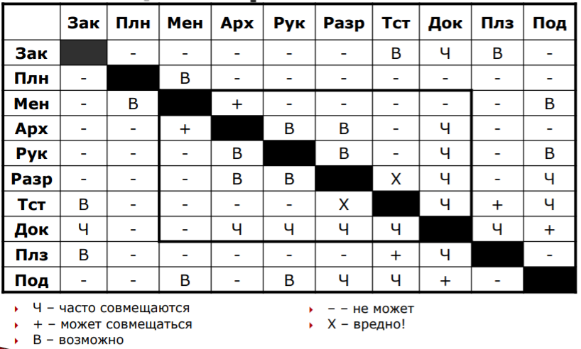
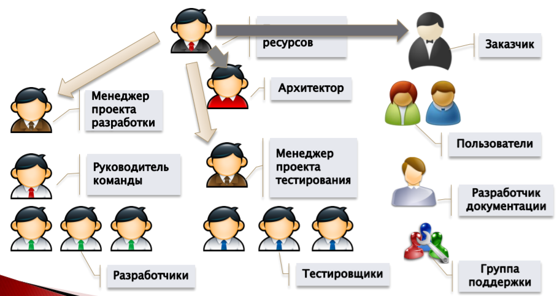
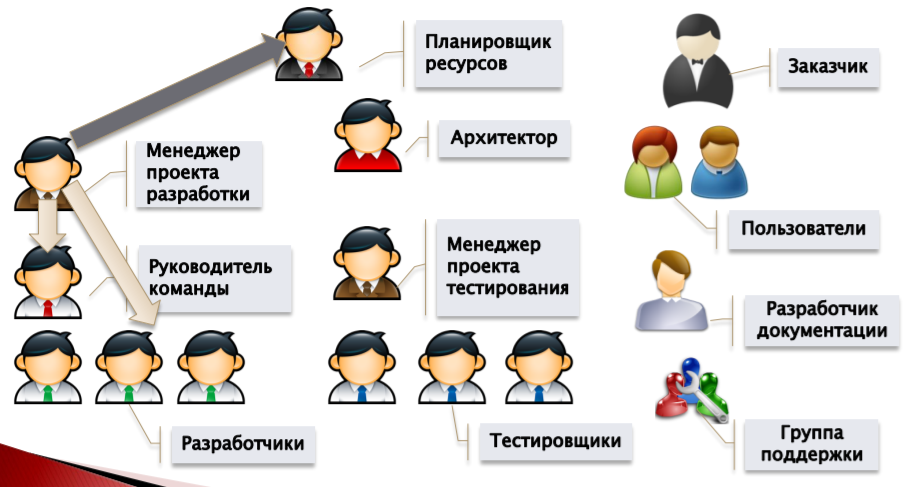
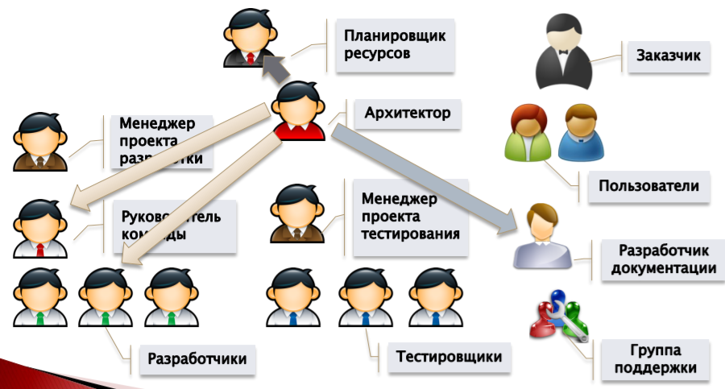
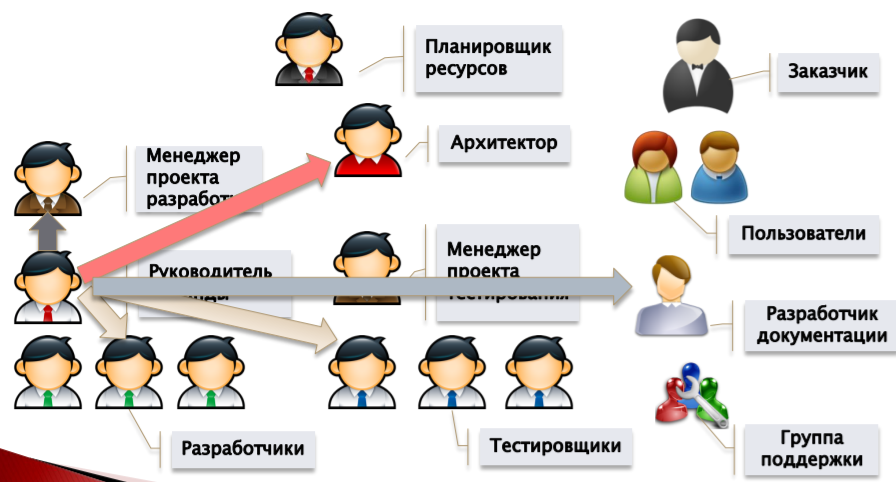
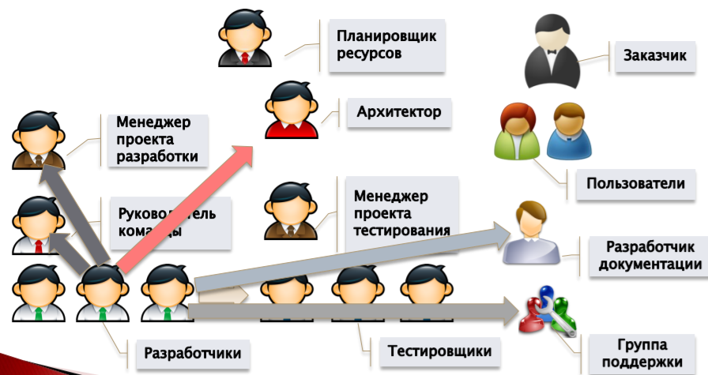
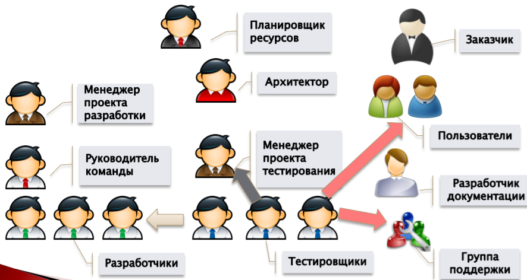
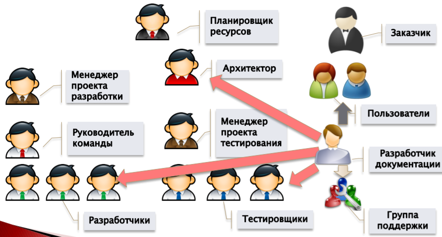
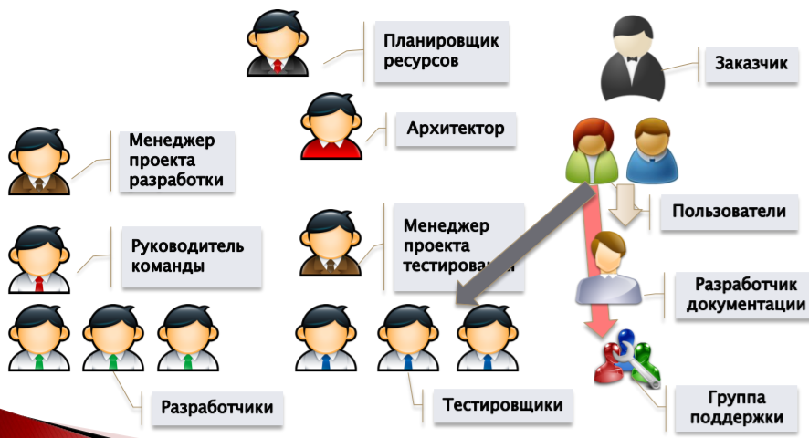
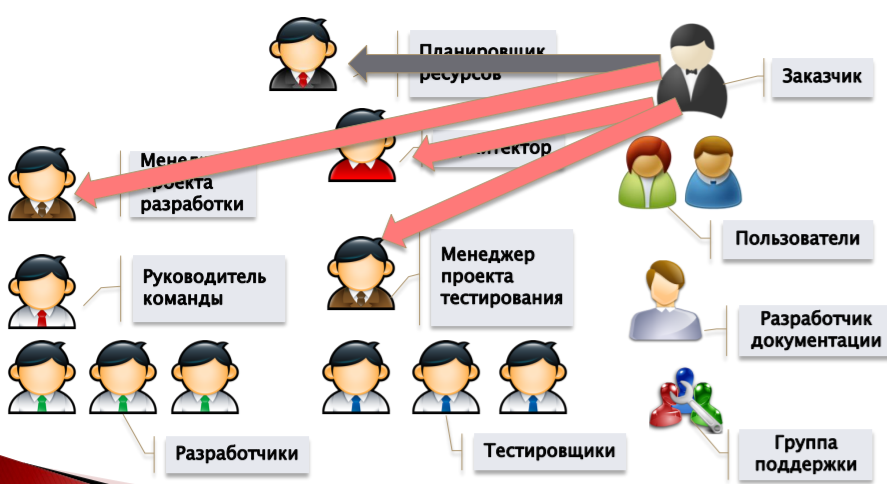

# 22. Роли участников в программных проектах

Роль - конкретное амплуа сотрудника в конкретном проекте в определенное время. 
В программных проектах обычно оперируют ролями, а не сотрудниками.

Состав, назначение и функциональные обязанности ролей зависят от конкретного процесса разработки в компании. 
В принципе возможно совмещение разных ролей в разных проектах.

## Роли в процессе разработки программных проектов:

- Основные:
  - __заказчик__ (customer)
  - __планировщик ресурсов__ (planner)
  - __менеджер проекта__ (project manager)
  - __архитектор__ (architect)
  - __руководитель команды__ (team leader, team lead)
  - __разработчик__ (developer)
  - __тестер__ (tester, QA)
  - __разработчик документации__ (technical writer)
  - __пользователь__ (user)
  - __инженер группы поддержки__ (support engineer)

- Дополнительные:
  - __эксперт предметной области__
  - __специалист по пользовательскому интерфейсу и эргономике__
  - __ответственный за выпуск релизов__
  - и т.д.

## Конкретнее о некоторых ролях:

### Заказчик:

- Инициирует разработку
- Участвует в сборе требований
- Участвуете в разработке спецификаций требований
- Принимает результаты разработки

### Планировщик ресурсов:

- Член руководства организации 
- Выдвигает и координирует требования к проектам в организации
- Развивает и направляет план выполнения проекта с точки зрения организации
- Обеспечивает финансирование проекта

### Менеджер проекта:

- Внешние функции:
  - взаимодействия с _заказчиком_ и _планировщиком ресурсов_
- Внутренние функции:
  - Распределяет задачи среди членов команды
  - Организует выполнение проекта
  - Контролирует процесс разработки

### Архитектор:

- Проектирует архитектуру системы
- Разрабатывает основные проектные решения
- Определяет общий план развития проекта
- Определяет инфраструктуру разработки

### Руководитель команды:

- Является "главным разработчиком"
- Осуществляет техническое руководство командой
- Разрешает технические вопросы

### Разработчик:

- Реализует проектируемые компоненты
- Создает классы и методы
- Осуществляет кодирование
- Разрабатывает модульные тесты
- Выполняет автономное тестирование
- Внутри команды может иметь специализацию

### Тестировщик:

- Проверяет качество программного обеспечения (функциональность, надежность, эффективность и т.д.). 
  Составляет тесты для каждой фазы проектирования продукта.
- Исполняет созданные тесты
- Выполняет функциональное тестирование 
- Выполняет интеграционное, системное тестирование

### Разработчик документации: 

- Разработка программной документации
- Разработка эксплуатационной документ
- Ведение информационной поддержки процесса разработки

### Пользователь:

- Не является заказчиком проекта
- Может являться, а может и не являться сотрудником проекта
- Является главным потребителем проекта
- Обычно существуют группы пользователей проекта

### Эксперт предметной области: 

- Обеспечивает информационную поддержку в предметной области проекта
- Может быть несколько экспертов, если проект большой

### Специалист по пользовательскому интерфейсу и эргономике:

- Проектирует пользовательские интерфейсы
- Взаимодействует с заказчиком
- Анализирует и оценивает комплексные характеристики интерфейса:
  - Удобство
  - Эргономичность
  - Лаконичность 
  - Дружественность
  - Локализуемость
  - ...

### Ответственный за выпуск релиза:

- Определяет и реализует политику выпуска релизов
- Формирует и проверяет требования к конкретному релизу:
  - Необходимая функциональность
  - Состав релиза
- Определяет дату выхода релиза
- Контролирует процесс выхода релиза

### Библиотекарь:

- Ведет библиотеку проекта
- Контролирует соответствие выпускаемого продукта принятым стандартам

## Совмещение ролей

# 23. Взаимодействие между ролями в программных проектах

## Связи для планировщика ресурсов

## Связи для менеджера проекта

## Связи для архитектора

## Связи для руководителя команды

## Связи для разработчика

## Связи для тестировщика

## Связи для разработчика документации

## Связи для пользователя

## Связи для заказчика

