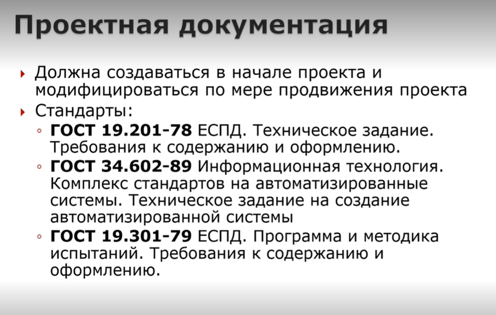
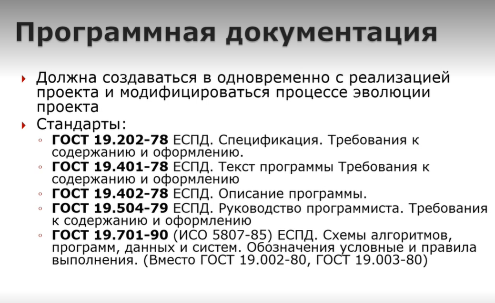
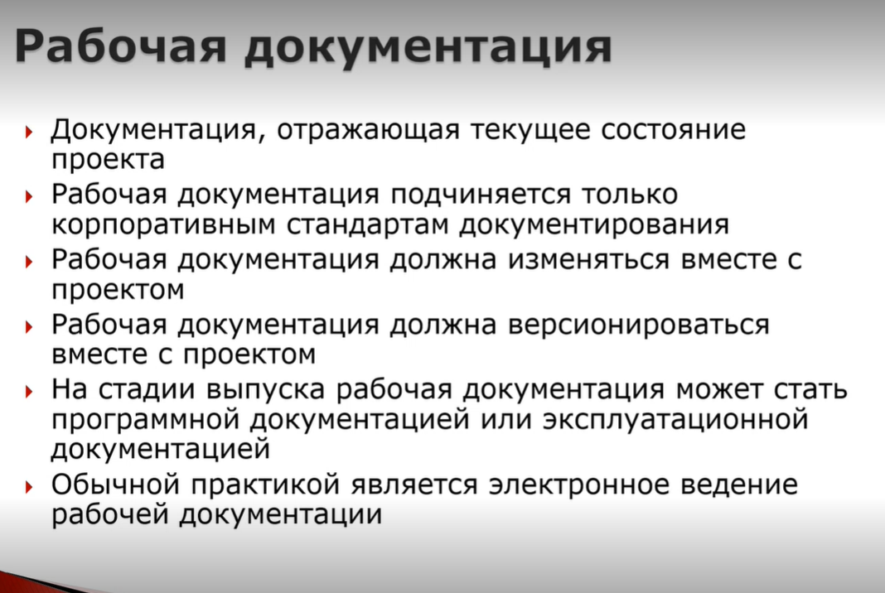
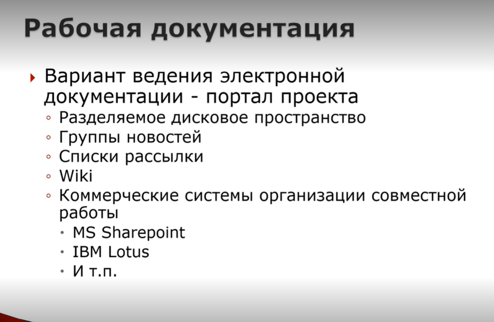
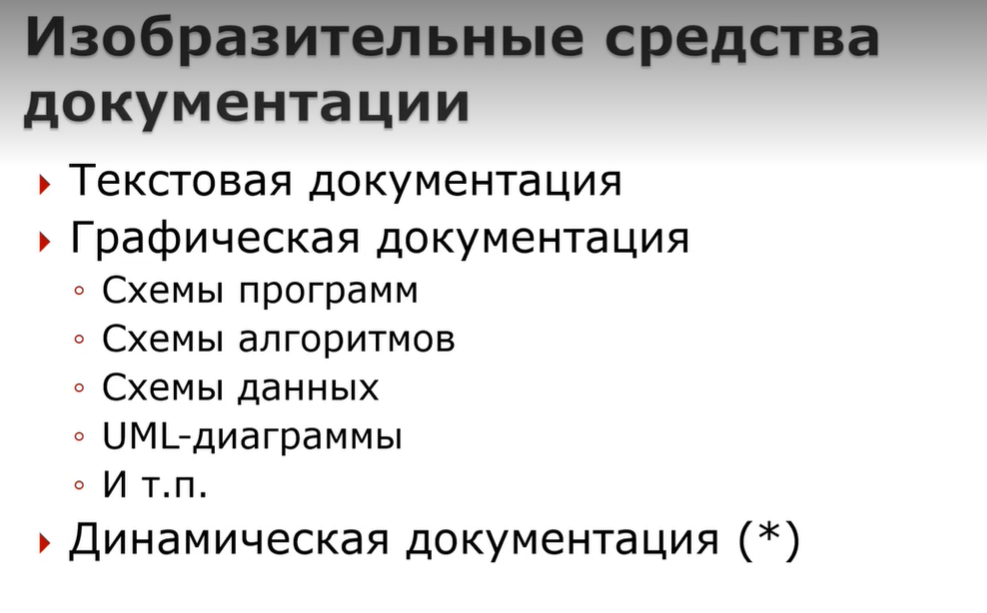
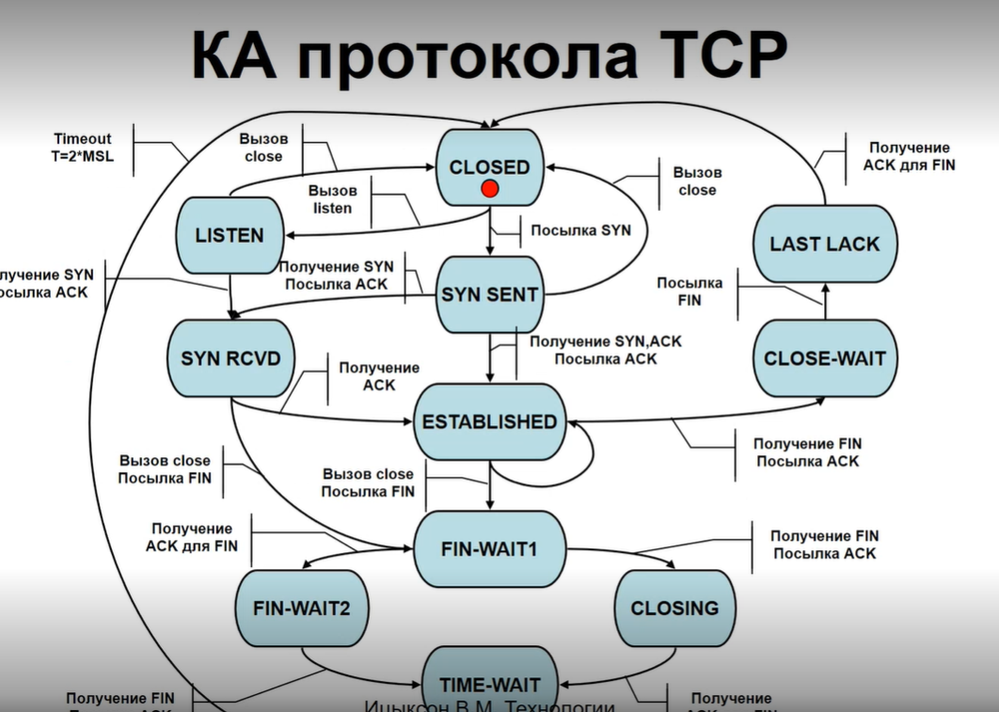
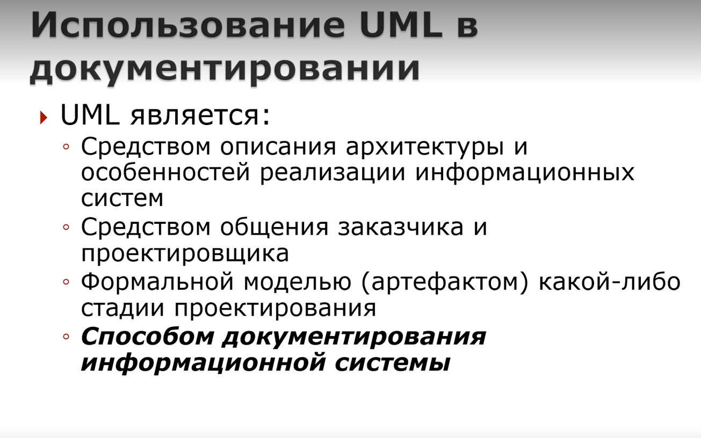
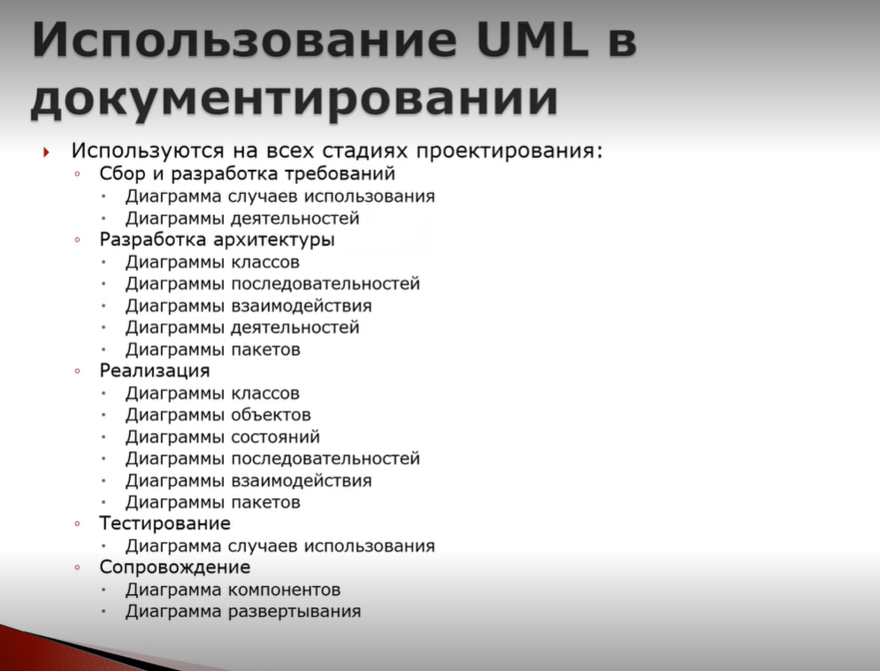

# ?. Документирование ПО. Виды программной документации.
## нет такого билета

Виды документации:

- **Проектная** - та документация, которая сопровождает программное обеспечение и содержит информацию о принятых технических решениях.
- **Программная** - описывает разработанное программное обеспечение и входящие в его состав артефакты.
- **Эксплуатационная** - описывает процесс использования программного продукта.
- **Рабочая** - не совсем верно ее выделять, представляет из себя различные реинкарнации в процессе разработки проекта проектной, программной и эксплуатационной документации (Ицыксон так сказал).

## Проектная документация.

Обычно создается в начале проекта и модифицируется по мере продвижения проекта.

Стандарты относятся ко всему проекту, а не к отдельным артефактам.

В состав проектной документации может входить документация, описывающая принятие проектные решения, архитектуру. ГОСТа на архитектуру нет, обычно входит в состав других документов.

## Программная документация

Программная документация посвящена описанию отдельных программных артефактов, создается в процессе разработки ПО, эволюционирует совместно с проектом.

Руководство программиста - для тех, кто будет использовать программу, не зная ее содержание (API)

## Эксплуатационная документация

Обычно создается по окончанию проекта, эволюционирует вместе со всеми дальнейшими изменениями проекта, предназначена для того, чтобы пользователь мог воспользоваться продуктом.

Руководство оператора - для тех, кто использует ПО

Руководство по техническому обслуживанию - для технических процедур (например, очистка баз данных, бэкапы и т.п.)

Руководство системного программиста - руководство по администрированию, настройке (для сисадминов).

## Рабочая документация

Рабочая документация - не тип документации, а ее состаяние. Отображает состояние проекта в текущий момент. 
Если процессы в компании поставлены правильно, то рабочая документация может стать программной или эксплуатационной (идеальное завершение жизненного цикла).

## Динамическая документация

**Динамическая документация** - документация в виде динамических артефактов, которые описывают,как устроена система.

КА протокола TCP - пример динамической документации. 

В некоторых случаях динамическая документация удобнее других типов.

# ?. Использование UML в документировании
## нет такого билета

Очень много времени и сил было потрачено на создание языка UML. 

**Язык UML** - это набор из около 2х десятков диаграмм, которые позволяют описывать разные аспекты ПО, в некоторых проектах (особенно для информационных систем) UML вполне пригоден.

UML не стал панацеей, хотя считалось, что им можно будет описывать все процессы разработки ПО. Оказалось, что он удобен далеко не везде.

**Диаграмма последовательностей** - показывают динамику диаграммы взаимодействия.

При разработке **диаграммы пакетов** показывает распределение функциональности по пакетам.

**Диаграммы состояний** - показывают динамику управления объектов и могут описывать реализацию элементов.

**Диаграмма компонентов** - показывает модульную структуру разработанной системы.

**Диаграмма развертывания** - показывает проецирование отдельных артефактов разработки на физическую архитектуру.

# ?. Генерация документации
## нет такого билета
Данный подход придуман давно Дональдом Кнутом. Оп предложил концепцию граммотного программирования и язык программирования WEB. WEB не имеет отношения к WWW это специализированный ЯП в котором было предложенно объединить внутри одного артефакта текст и документацию. И дальше использовть 2 компилятора. Один для получения кода, а второй для документации. Например, javadoc основана на концепции граммотного программирования. 

Основной подход сейчас - аннотирование текста программы с помощью структурированных комментариев которые позволяют описывать описывать программные модули, функции, классы, переменные, параметры функций и методов. Эти комментарии по сути своей язык с ключевыми словами которые не мешают при компиляции основным компилятором, но помогают при генерации документации а также помогают средам разработки  делать интерактивные подсказки, например, какие параметры есть у метода.

На основе этих аннотаций могут генерироваться:

- html – страницы
- Документ Word, rtf
- Документ PDF
- Документы XML

Этот подход может использоваться при подготовке программной документации. Есть два документа где эти комментарии нам помогут:

- Описание программы
- Руководство программиста. Этот докумет иногда при помощи подобных комментариев может быть создан полностью на 100%

Генераторы документации:

- Java - Javadoc

- C++ - Cppdoc

- Object Pascal - Pasdoc

- JavaScript - JSDoc

- Многоязыковые - Doxygen 

  Пример
  

# ?.Промышленные технологии документирования
## нет такого билета
Такая документация может быть гигантского размера. В разных документах страницы могут частично повторяться, в зависимости от конфигурации под которую делается документ часть разделов документации повторяться, поэтому подход "копировать-вставить" не применим

Основные принципы

- Принцип единого источника - описание в одном месте а использование в документации в нескольких местах
- Использование структурированных текстовых форматов хранения документации
- Отделение семантики от форматирования - семантика храниться в виде структурированных текстовых документов в системе контроля версий. Форматирование меняется в зависимости от того, с какой целью создается документация
- Многократное использование контента
- Генерация многих видов документов из одной основы
  - Программная документация
  - Эксплуатационная документация
  - нтерактивные системы помощи
  - т.п.

- Поддержка разных форматов (HTML, PDF, ODF,
  DOCX и т.п.)

## LaTeX

- Набор макрорасширений для TeX
- Используется система тэгов для форматирования документов
- Поддерживается экспорт во все популярные форматы
- Последняя версия – LaTeХ 3ɛ

LaTeX - это текстовый формат, значит его можно хранить как текстовый артефакт и хранить  в системе котроля версий с возможностью сравнения версий, инкрементального хранения.

Пример:

## DITA

- Расшифровывается как Darwin Information Typing Architecture
- Разработана IBM
- Оформленна в виде стандарта OASIS: DITA 1.3, декабрь 2015 г.
- Dita - это набор XML–тегов и DTD-темы, которые описывают, как из описания формируются окончательные документы
- Охватывает весь цикл разработки, выпуска технической документации. Есть текстовые редакторы и конверторы текста.

## DocBook

- Стандарт OASIS: DocBook 5.1, ноябрь 2016 г.
- Набор XML-тэгов, структурирующих элементы документации
- XML-схема для валидирования коректности сохданного документа
- DocBook предоставляет более 400 тэгов
- Независимость содержания от представления. - Сам XML содержит только содержание а представление реализуется с помощью специального конвертера
- Принцип единого источника
- Легко конвертируется в любой формат
- Существуют DocBook-редакторы и фильтры для популярных текстовых процессоров

Так как этот формат не так удобен как LaTeX, есть специальные редакторы для DocBook или наборы шаблонов Office, чтобы можно было DocBook документ создавать внутри Office и после форматировать и преобразовывать при помощи стандартных процессоров.